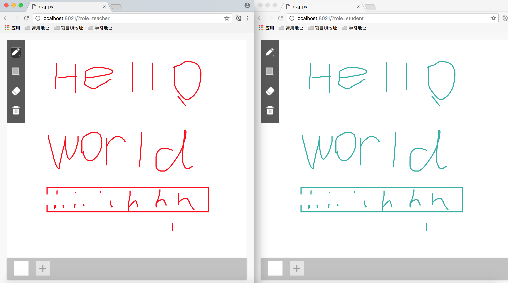

## 一个基于d3.js的svg画板，并且利用socket.io提供多端共享

### demo



### 基本配置
```
wrapperCls: '.canvasBoardWrapper', //整个花画板的包裹类名
pencilCls: '.pencil', //根据class来获取按钮
rectCls: '.rect',
eraseCls: '.erase',
rubbinCls: '.rubbin',
eraserWidth: 30, //橡皮擦宽度
eraserHeight: 30, //橡皮擦高度
svgWidth: '100%', //默认画布的宽度
svgHeight: '100%', //默认画布的高度
pencilWidth: 3, //画笔粗细
pencilColor: 'red',//画笔颜色
drawBeginCallback: null, //mousedown的回调
drawCallback: null, //mousemove的回调
drawEndCallback: null, //mouseup的回调
```

### to do

1.撤销动作 --finish
2.g/path重组 -finish
3.性能优化

